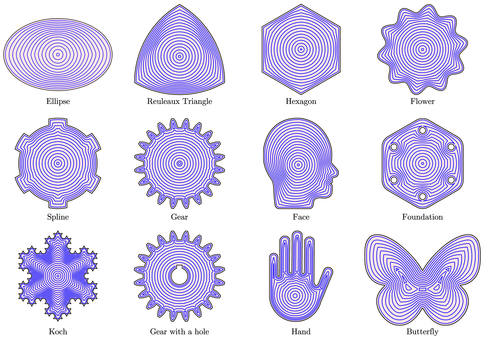
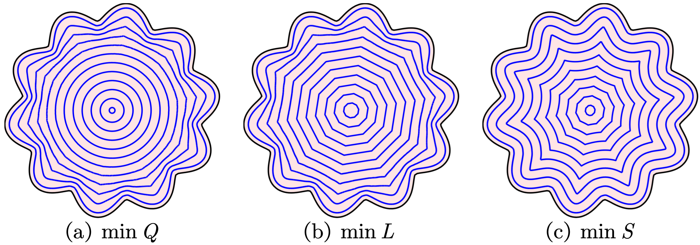

# NEPath

## An Optimization-Based Non-Equidistant Toolpath Planning Library (In C++)

[](https://www.boost.org/LICENSE_1_0.txt)

The **NEPath** library plans toolpaths for [additive manufacturing (AM, 3D printing)]([3D printing - Wikipedia](https://en.wikipedia.org/wiki/3D_printing)) and [CNC milling](https://en.wikipedia.org/wiki/Numerical_control). Toolpath planning is to generate some 1D toolpaths to filling given 2D slices. The **NEPath** library is able to plan the following toolpaths:

+ Optimization-based non-equidistant toolpath:
	+ **Isoperimetric-Quotient-Optimal Toolpath (IQOP)**. (Temporarily unavailable)
	+ Other non-equidistant toolpaths and even user-designed toolpaths would be updated soon.
+ Classical toolpath:
	+ **Contour-Parallel Toolpath (CP)**.
	+ **Zigzag Toolpath**.
+ Toolpath connection. (Temporarily unavailable)

Among them, the IQOP is proposed by Wang et al., with an article under review, i.e., 

```
Yunan Wang, Chuxiong Hu, et al. Optimization-Based Non-Equidistant Toolpath Planning for Robotic Additive Manufacturing with Non-Underfill Orientation[J]. Robotics and Computer-Integrated Manufacturing. (under review)
```

After the article is published, the **NEPath** library would provide the API and details of IQOP. More non-equidistant toolpaths would be designed soon.

### Complier

C++17

### Statement

+ This project cites [AngusJohnson/Clipper2](https://github.com/AngusJohnson/Clipper2) as a dependent package.
+ This project depends on [Gurobi](https://www.gurobi.com/) optimizer for solving [quadratically constrained quadratic program](https://en.wikipedia.org/wiki/Quadratically_constrained_quadratic_program) with [second-order cone constraints](https://en.wikipedia.org/wiki/Second-order_cone_programming). If you need to use another optimizer, you can rewrite the method in the `MyOptimization` function.

## Introduction to IQOP

IQOP is an optimization-based non-equidistant toolpath planning method for AM and CNC milling. IQOP tries to optimize the smoothness and material cost of the child toolpath from a parent toolpath. IQOP has the following advantages:

+ Compared with the equidistant toolpath, i.e., CP, IQOP can generate smooth toolpaths. Specially, toolpaths insides tends to transform into a smooth circle.
+ IQOP can be applied for slices with arbitrary shapes and topological holes. Extra toolpaths would be added if underfill with large area exists.
+ IQOP achieves obviously lower underfill rates, higher printing efficiency, and higher toolpath smoothness than CP.
+ A general framework of non-equidistant toolpath planning for complex slices is provided.



<center>Figure. Some demos of IQOP.</center>



<center>Figure. Toolpaths generated by different object functions.</center>


<center>Figure. Toolpaths generated by different weighting coefficient.</center>

More details of IQOP would be provided after the article is published.

## API and Examples

### Toolpath Generation

#### IQOP (Isoperimetric-Quotient-Optimal Toolpath, Wang Y et al.)

The API and examples of IQOP would be provided after the article is published.

#### CP (Contour-Parallel)

#### Zigzag

### Toolpath Connection

The API and examples of toolpath connection 


