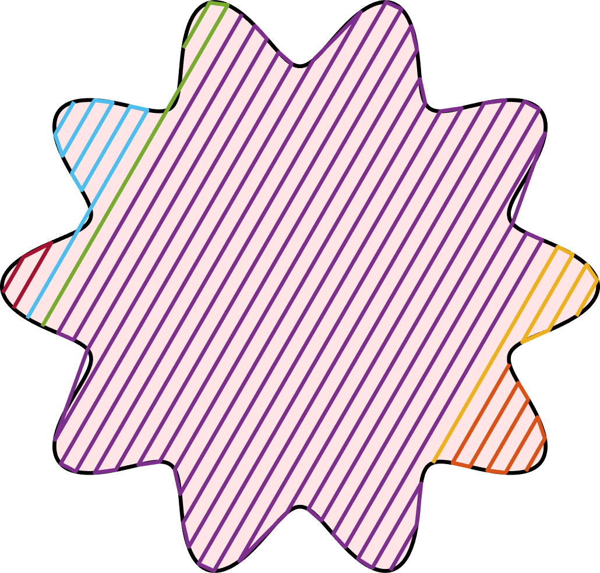

# NEPath

## An Optimization-Based Non-Equidistant Toolpath Planning Library (In C++)

[](https://www.boost.org/LICENSE_1_0.txt)

The **NEPath** library plans toolpaths for [additive manufacturing (AM, 3D printing)]([3D printing - Wikipedia](https://en.wikipedia.org/wiki/3D_printing)) and [CNC milling](https://en.wikipedia.org/wiki/Numerical_control). Toolpath planning is to generate some 1D toolpaths to filling given 2D slices. The **NEPath** library is able to plan the following toolpaths:

+ Optimization-based non-equidistant toolpath:
	+ **Isoperimetric-Quotient-Optimal Toolpath (IQOP)**. (Temporarily unavailable)
	+ Other non-equidistant toolpaths and even user-designed toolpaths would be updated soon.
+ Classical toolpath:
	+ **Contour-Parallel Toolpath (CP)**.
	+ **Zigzag Toolpath**.
	+ **Raster Toolpath**.
+ Toolpath connection. (Temporarily unavailable)
+ Other functions:
	+ Tool Compensating.
	+ Calculating underfill rate. (Temporarily unavailable)
	+ Determining sharp corners. (Temporarily unavailable)

Among them, the IQOP is proposed by Wang et al., with an article under review, i.e., 

```
Yunan Wang, Chuxiong Hu, et al. Optimization-Based Non-Equidistant Toolpath Planning for Robotic Additive Manufacturing with Non-Underfill Orientation[J]. Robotics and Computer-Integrated Manufacturing. (under review)
```

After the article is published, the **NEPath** library would provide the API and details of IQOP. More non-equidistant toolpaths would be designed soon.

### Complier

C++17

### Statement

+ This project cites [AngusJohnson/Clipper2](https://github.com/AngusJohnson/Clipper2) as a dependent package.
+ This project depends on [Gurobi](https://www.gurobi.com/) optimizer for solving [quadratically constrained quadratic program](https://en.wikipedia.org/wiki/Quadratically_constrained_quadratic_program) with [second-order cone constraints](https://en.wikipedia.org/wiki/Second-order_cone_programming). If you need to use another optimizer, you can rewrite the method in the `MyOptimization` function.

## Introduction to IQOP

IQOP is an optimization-based non-equidistant toolpath planning method for AM and CNC milling. IQOP tries to optimize the smoothness and material cost of the child toolpath from a parent toolpath. IQOP has the following advantages:

+ Compared with the equidistant toolpath, i.e., CP, IQOP can generate smooth toolpaths. Specially, toolpaths insides tends to transform into a smooth circle.
+ IQOP can be applied for slices with arbitrary shapes and topological holes. Extra toolpaths would be added if underfill with large area exists.
+ IQOP achieves obviously lower underfill rates, higher printing efficiency, and higher toolpath smoothness than CP.
+ A general framework of non-equidistant toolpath planning for complex slices is provided.


<center>Figure. Some demos of IQOP.</center>


<center>Figure. Toolpaths generated by different object functions.</center>


<center>Figure. Toolpaths generated by different weighting coefficient.</center>

More details of IQOP would be provided after the article is published.

## API and Examples

### Toolpath Generation

#### IQOP (Isoperimetric-Quotient-Optimal Toolpath, Wang Y et al.)

The API and examples of IQOP would be provided after the article is published.

#### CP (Contour-Parallel)

#### Zigzag

##### Package

```c++
#include "NEPath-master/NEPathPlanner.h"
#include "NEPath-master/PlanningOptions.h"
#include "NEPath-master/FileAgent.h"
```

##### API

+ The contour of slices can be set by calling `NEPathPlanner::set_contour()`, while the holes (optional) can be set by calling `NEPathPlanner::addhole()` or `NEPathPlanner::addholes()` .
+ The zigzag toolpaths can be planned by calling `NEPathPlanner::Zigzag()`.
+ The toolpath parameters of zigzag toolpath can be set in `DirectParallelOptions`.

##### Example

```c++
NEPathPlanner planner;

// Set the contour
path contour;
contour.length = 1000; // the number of waypoints
contour.x = new double[contour.length](); // x-coordinate of waypoints
contour.y = new double[contour.length](); // y-coordinate of waypoints
const double pi = acos(-1.0); // pi == 3.1415926...
for (int i = 0; i < contour.length; ++i) {
    double theta = 2.0 * pi * i / contour.length;
    double r = 15.0 * (1.0 + 0.15 * cos(10.0 * theta));
    contour.x[i] = r * cos(theta);
    contour.y[i] = r * sin(theta);
}
planner.set_contour(contour);
// or `planner.set_contour(contour.x, contour.y, contour.length)`

// Set the toolpath parameters
DirectParallelOptions opts;
opts.delta = 1.0; // the line width of toolpaths
opts.angle = pi / 3.0; // the angle of Zigzag toolpaths, unit: rad

paths zigzag_paths = planner.Zigzag(opts); // all zigzag paths
cout << "There are " << zigzag_paths.size() << " continuous toolpaths in total." << endl;
for (int i = 0; i < zigzag_paths.size(); ++i) {
    // zigzag_paths[i] is the i-th continuous toolpath
    cout << "Toopath " << i << " has " << zigzag_paths[i].length << " waypoints." << endl;
}
```




### Toolpath Connection

The API and examples of toolpath connection would be available soon.


